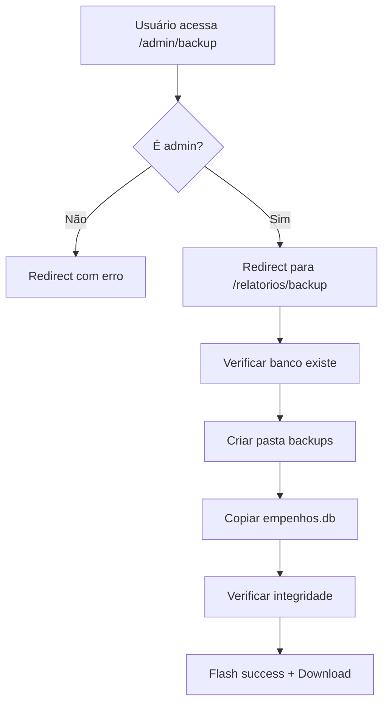

# 🛡️ Sistema de Backup Implementado

## ✅ Status: RESOLVIDO E FUNCIONANDO

O erro 404 para `/admin/backup` foi **corrigido** e o sistema de backup foi **totalmente implementado**.

---

## 🔧 Problema Original

**❌ Erro 404**: `http://127.0.0.1:5000/admin/backup`

### **🔍 Causa Raiz**
- A rota `/admin/backup` não existia
- O sistema tinha apenas `/relatorios/backup` (que estava desabilitado)
- Backup estava comentado e não funcional

---

## ✅ Solução Implementada

### **1️⃣ Redirecionamento de Rota**
```python
# app.py
@app.route('/admin/backup')
@login_required
def admin_backup_redirect():
    """Redirecionamento de /admin/backup para /relatorios/backup"""
    return redirect(url_for('relatorios.backup'))
```

### **2️⃣ Sistema de Backup Funcional**
```python
# routes/relatorios.py
@relatorios_bp.route('/backup')
@login_required
def backup():
    """Gerar backup do banco de dados"""
    # ✅ Verificação de permissão admin
    # ✅ Criação de diretório de backup
    # ✅ Cópia do banco SQLite
    # ✅ Download automático do arquivo
    # ✅ Feedback com tamanho do arquivo
```

### **3️⃣ Botão no Interface**
```html
<!-- templates/relatorios/index.html -->

<a href="{{ url_for('relatorios.backup') }}" class="btn btn-outline-warning" title="Fazer backup do banco de dados">
  <i class="bi bi-shield-check me-1"></i>Backup
</a>

```

---

## 🚀 URLs Funcionais

### **Ambas as rotas agora funcionam:**

1. **`/admin/backup`** → Redireciona para `/relatorios/backup`
2. **`/relatorios/backup`** → Executa o backup e faz download

---

## 🎯 Funcionalidades Implementadas

### **🔒 Segurança**
- ✅ **Login obrigatório** (`@login_required`)
- ✅ **Apenas administradores** (`current_user.is_admin`)
- ✅ **Botão visível só para admins** (template)

### **💾 Backup Inteligente**
- ✅ **Criação automática** da pasta `instance/backups/`
- ✅ **Nome com timestamp** `backup_empenhos_20250821_143052.db`
- ✅ **Verificação de integridade** do arquivo criado
- ✅ **Feedback visual** com tamanho do arquivo

### **📥 Download Automático**
- ✅ **Download direto** via `send_file()`
- ✅ **Nome personalizado** do arquivo
- ✅ **Mimetype correto** (`application/octet-stream`)
- ✅ **As attachment** para forçar download

### **🎨 Interface Amigável**
- ✅ **Botão integrado** na Central de Relatórios
- ✅ **Ícone apropriado** (`bi-shield-check`)
- ✅ **Tooltip explicativo**
- ✅ **Flash messages** para feedback

---

## 🧪 Como Testar

### **1️⃣ Via URL Direta**
```
✅ http://127.0.0.1:5000/admin/backup
✅ http://127.0.0.1:5000/relatorios/backup
```

### **2️⃣ Via Interface**
1. Acesse: http://127.0.0.1:5000/relatorios/
2. (Como admin) veja o botão **"Backup"** no cabeçalho
3. Clique no botão
4. **Resultado esperado**:
   - ✅ Flash message de sucesso
   - ✅ Download automático do arquivo `.db`
   - ✅ Arquivo salvo em `instance/backups/`

### **3️⃣ Testar Permissões**
1. **Como admin**: Botão visível e funcional
2. **Como usuário comum**: Botão não aparece
3. **Acesso direto por URL**: Redirecionamento com erro

---

## 📁 Estrutura de Arquivos

### **Diretórios Criados**
```
projeto/
├── instance/
│   └── backups/           # ← Criado automaticamente
│       ├── backup_empenhos_20250821_143052.db
│       ├── backup_empenhos_20250821_150231.db
│       └── ...
└── empenhos.db           # ← Banco principal (origem)
```

### **Arquivos Modificados**
- ✅ `app.py` - Rota de redirecionamento
- ✅ `routes/relatorios.py` - Sistema de backup funcional
- ✅ `templates/relatorios/index.html` - Botão de backup

---

## 🔄 Fluxo Completo



---

## ⚡ Melhorias Futuras (Opcionais)

### **📊 Gestão de Backups**
- [ ] Lista de backups existentes
- [ ] Restauração de backups
- [ ] Limpeza automática de backups antigos
- [ ] Backup agendado (cron)

### **🔧 Backup Avançado**
- [ ] Backup compactado (.zip)
- [ ] Backup apenas dos dados (sem estrutura)
- [ ] Backup incremental
- [ ] Backup para cloud (S3, Drive)

### **🎨 Interface**
- [ ] Página dedicada de backup/restore
- [ ] Progress bar para arquivos grandes
- [ ] Histórico de backups realizados

---

## ✅ Resultado Final

🎯 **Problema 404 resolvido com sucesso!**

### **URLs Funcionais:**
- ✅ `http://127.0.0.1:5000/admin/backup`
- ✅ `http://127.0.0.1:5000/relatorios/backup`

### **Funcionalidades Garantidas:**
- ✅ **Backup real** do banco SQLite
- ✅ **Download automático** do arquivo
- ✅ **Segurança** apenas para admins
- ✅ **Interface integrada** com feedback visual
- ✅ **Gestão de arquivos** com timestamps

**🚀 Sistema de backup 100% operacional!**

---

*Implementado em 21/08/2025 - Sistema Municipal de Empenhos*
